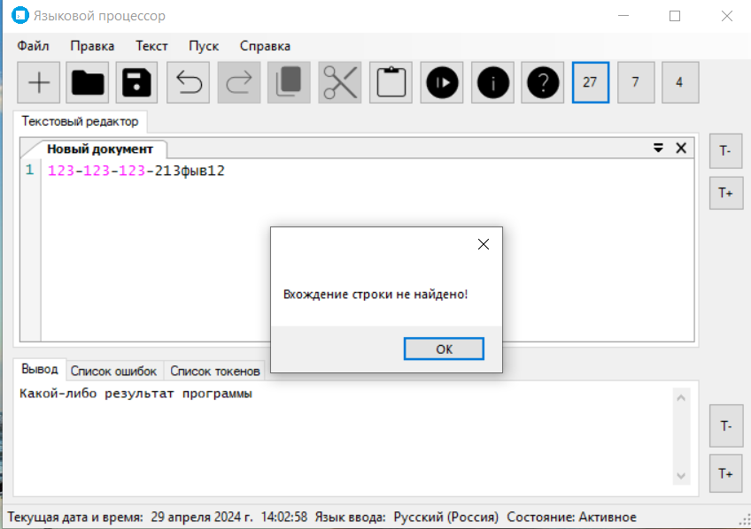
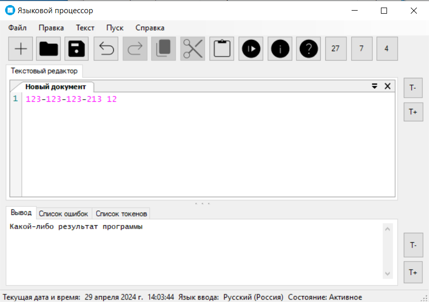
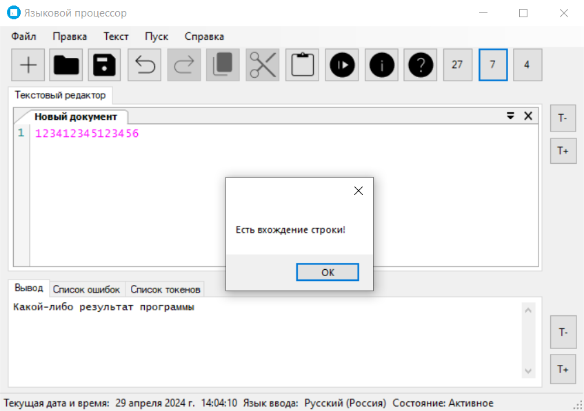
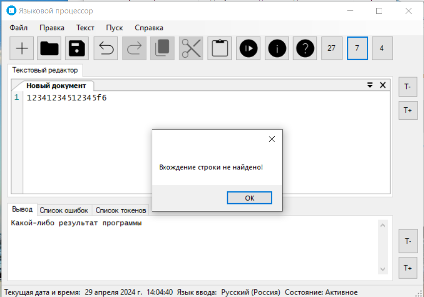
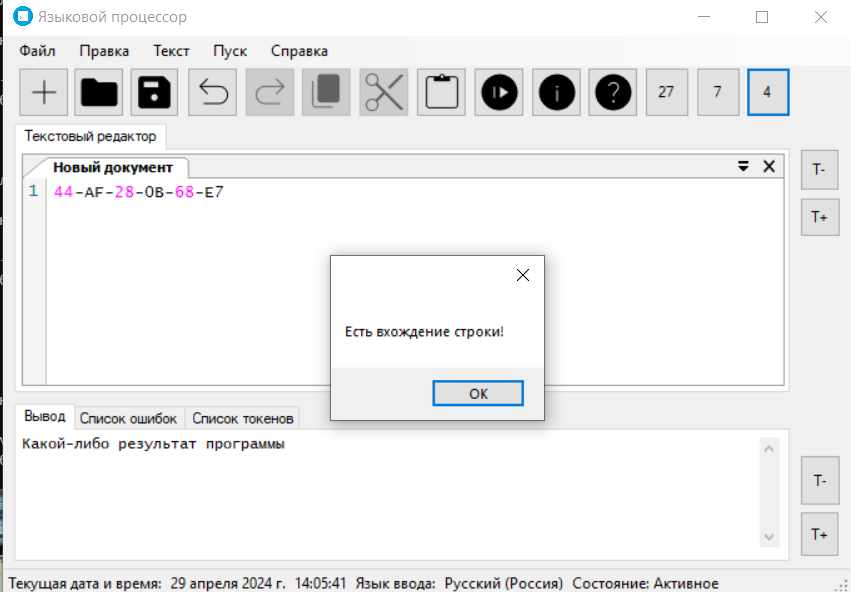
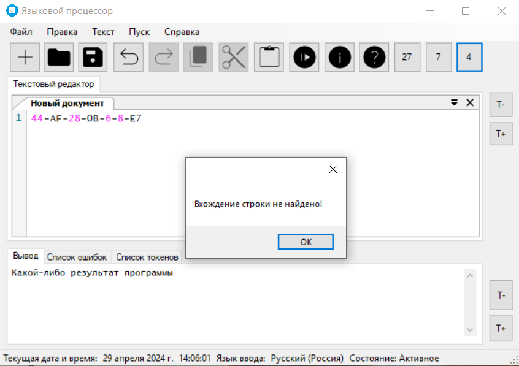

# Языковой процессор

## Тема лабораторной работы: Реализация алгоритма поиска подстрок с помощью регулярных выражений.

## Цель работы: Реализовать алгоритм поиска в тексте подстрок, соответствующих заданным регулярным выражениям.

## Задание: 

Используя библиотечные реализации (например, класс Regex в C#), решите 3 задачи в соответствии с персональным вариантом (варианты заданий в файле “ТФЯиК Задание на ЛР 6 АВТ-113, АВТ-114”). 

Необходимо встроить разработанные алгоритмы в интерфейс текстового редактора, разработанного на первой лабораторной работе. 

Исходные данные – текст, содержащий данные заданного формата. Выходные данные – найденные выражения с указанием позиции начала. Возможно выделение подстрок в исходном тексте.

1) 26 Построить РВ, описывающее СНИЛС.
`(\d{3}-\d{3}-\d{3} \d{2})+`




2) 7 Построить РВ, описывающее номера карт, принадлежащих
платежной системе Amex Card.
` (\d{4}\d{6}\d{5})`

Грамматика:

```
digit -> 0 | 1 | … | 9

EXPR -> digit EXPREM1
EXPRREM1 -> digit EXPRREM2
EXPRREM2 -> digit EXPRREM3
EXPRREM3 -> digit EXPRREM4
EXPRREM4 -> digit EXPRREM5
EXPRREM5 -> digit EXPRREM6
EXPRREM6 -> digit EXPRREM7
EXPRREM7 -> digit EXPRREM8
EXPRREM8 -> digit EXPRREM9
EXPRREM9 -> digit EXPRREM10
EXPRREM10 -> digit EXPRREM11
EXPRREM11 -> digit EXPRREM12
EXPRREM13 -> digit EXPRREM14
EXPRREM14 -> digit EXPRREM15
EXPRREM15 -> digit EXPRREM16
EXPRREM18 -> {0}
```



3) 4 Построить РВ, описывающее MAC-адрес.
`[\d\w]{2}-[\d\w]{2}-[\d\w]{2}-[\d\w]{2}-[\d\w]{2}-[\d\w]{2}`

Грамматика:

```
letter -> “a” | “b” | “c” | ... | “z” | “A” | “B” | “C” | ... | “Z”
digit -> 0 | 1 | … | 9
dash -> -
EXPR -> (leter | digit) EXPREM1
EXPRREM1 -> (leter | digit) EXPRREM2
EXPRREM2 -> dash EXPRREM3
EXPRREM3-> (leter | digit) EXPRREM4
EXPRREM4-> (leter | digit) EXPRREM5
EXPRREM5-> dash EXPRREM6
EXPRREM6-> (leter | digit) EXPRREM7
EXPRREM7-> (leter | digit) EXPRREM8
EXPRREM8-> dash EXPRREM9
EXPRREM9-> (leter | digit) EXPRREM10
EXPRREM10-> (leter | digit) EXPRREM11
EXPRREM11-> dash EXPRREM12
EXPRREM13-> (leter | digit) EXPRREM14
EXPRREM14-> (leter | digit) EXPRREM15
EXPRREM15-> dash EXPRREM16
EXPRREM16-> (leter | digit) EXPRREM17
EXPRREM17-> (leter | digit) EXPRREM18
EXPRREM18-> {0}
```


